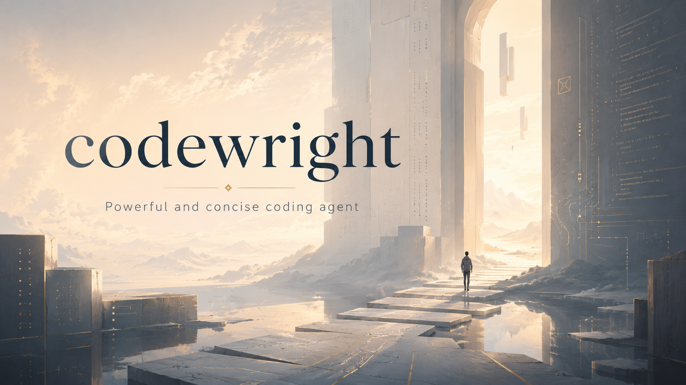

# Codewright



<div align="center">
  <p>
    <a href="./README.md">English</a> |
    <a href="./README_zh.md">简体中文</a>
  </p>
  <p>
    
    
    
    
    
    <a href="./LICENSE"></a>
    <a href="https://github.com/Caldalis/codewright/graphs/commit-activity"></a>
    <a href="https://github.com/Caldalis/codewright/issues"></a>
  </p>
</div>

一个强大而简洁的命令行编码 agent，使用 Python 编写。

Codewright：一个流式 LLM 循环、多态工具运行时、多 agent 编排、会话持久化、MCP
工具服务器，以及一个交互式 TUI。

## 功能特性

- **交互式 TUI**：流式输出、状态栏，以及模态审批弹窗。
- **非交互模式**：适用于一次性提示与脚本化调用。
- **语义化文件工具**（`read_file`、`list_dir`、`find_files`、`search_text`），
  外加有状态的 **`shell`** 工具族（以 bash 为基准，支持后台任务与输出分页），
  以及事务性的 **`apply_patch`** 编辑。
- **任务规划**：agent 维护一份实时、分步的计划（`update_plan`），并流式推送到
  TUI，让你随时看到进展。
- **权限档位（Permission profiles）**：对破坏性 shell 命令与工作区外访问进行门禁控制。
- **多 agent**：可派生子 agent，每个子 agent 在各自隔离的会话中以一个内置角色运行
  —— `explorer`（只读调研）、`worker`（限定范围的执行）或 `default` —— 并向父
  agent 汇报。主 agent 的角色由 `[agent] default_role` /
  `CODEWRIGHT_DEFAULT_ROLE` 设置。
- **项目说明（Project instructions）**：工作区中的 `AGENTS.md`（或 `.agents.md`）
  —— 从工作目录向上一直搜索到工作区根目录 —— 会在每一轮被注入，作为对 agent 的指引。
- **技能（Skills）**：位于 `<workspace>/skills/` 下、项目范围内的说明与工作流
  （agentskills.io 格式）。你可以手工编写，也可以让 agent 自动把可复用、经测试验证的
  知识蒸馏成新技能；在后续任务中，它会通过 `skill` 工具把相关技能重新取回。
- **MCP** 工具服务器：支持 stdio 与 streamable-http。
- **自动上下文压缩**：当历史接近模型的上下文窗口时，会就地将其总结压缩，使长会话
  得以持续运行。
- **会话持久化 + 恢复**：通过仅追加（append-only）的 JSONL rollout 实现。
- **可插拔的提供方（Providers）**：OpenAI Chat Completions 或 Responses API，以及
  任何 OpenAI 兼容端点（DeepSeek、Qwen/DashScope、Ollama、本地网关）。

## 环境要求

- Python **3.12**（`>=3.12,<3.13`）
- [`uv`](https://docs.astral.sh/uv/)
- 一个 LLM 提供方的 API key（见 [配置](#配置)）

## 安装

### 作为全局命令（推荐）

将 Codewright 安装为独立工具，这样 `codewright` 在任意目录下都可用：

```bash
uv tool install --editable .      # 在仓库根目录执行一次
uv tool update-shell              # 如果 uv 的工具 bin 目录不在 PATH 中（执行后重开终端）
```

`--editable` 以源码方式安装，因此后续的代码改动无需重新安装即可生效。省略它则会安装
一个固定快照（用 `--reinstall` 重新执行来更新）。`pipx install --editable .` 同样可用。

### 从源码运行（开发）

```bash
uv sync                           # 安装依赖（含 dev 依赖组）
uv run codewright --help          # 无需全局安装即可运行（在仓库内）
```

## 快速开始

```bash
# 在当前目录启动交互式 TUI（裸命令 == `codewright tui`）：
codewright

# 在指定工作区启动交互式 TUI：
codewright --workspace path/to/project

# 执行一轮非交互对话，并打印最终消息：
codewright run "explain what this project does" --workspace .

# 列出并恢复已保存的会话：
codewright list-sessions
codewright resume <session_id>                 # 在 TUI 中重新打开
codewright resume <session_id> --message "now add tests"   # 只执行一轮，然后退出
```

## 配置

配置从 `~/.codewright/config.toml` 读取。最终生效值的优先级（高者胜出）：
**CLI 参数 > 环境变量 > 配置文件 > 内置默认值**。

你唯一必须提供的就是模型的 API key —— 其余一切都有默认值。可通过以下任一方式提供 key：

| 来源 | 方式 |
|---|---|
| `OPENAI_API_KEY` | 在 shell 中导出（最简单） |
| `CODEWRIGHT_API_KEY` | 在 shell 中导出 |
| `[llm] api_key_env` | 保存 key 的环境变量名（让密钥不出现在文件里） |
| `[llm] api_key` | 直接内联写入 key（不推荐；明文） |

一个最小化的 `~/.codewright/config.toml`：

```toml
[llm]
model = "gpt-4o"
api_key_env = "OPENAI_API_KEY"
# base_url = "https://api.deepseek.com/v1"   # 用于 OpenAI 兼容的提供方
```

完整选项请见 [`examples/config.example.toml`](examples/config.example.toml)，其中
列出了每个选项（模型/提供方、上下文窗口、权限档位、shell 路径、技能测试运行器，以及
MCP 服务器）的默认值与说明。

常用的环境变量覆盖项：`CODEWRIGHT_MODEL`、`CODEWRIGHT_API_KEY`、
`CODEWRIGHT_API_KEY_ENV`、`CODEWRIGHT_BASE_URL`（或 `OPENAI_BASE_URL`）、
`CODEWRIGHT_PERMISSION_PROFILE`、`CODEWRIGHT_DEFAULT_ROLE`、`CODEWRIGHT_SHELL_PATH`、
`CODEWRIGHT_MAX_CONTEXT_TOKENS`、`CODEWRIGHT_COMPACT_THRESHOLD`。

## 命令

| 命令 | 说明 |
|---|---|
| `codewright` | 在当前目录启动交互式 TUI（`tui` 的别名）。 |
| `codewright tui` | 启动交互式 TUI。 |
| `codewright run <prompt>` | 执行单轮非交互对话并打印最终消息。 |
| `codewright resume <session_id>` | 恢复已保存的会话（TUI；或用 `--message` 执行一轮）。 |
| `codewright list-sessions` | 列出工作区中已保存的会话。 |

常用参数：`--workspace <dir>`（默认：当前目录）、`--model`、
`--provider-base-url`、`--api-style {chat_completions,responses}`、
`--permission-profile {read_only,workspace_write,dangerous}`。`run` 还接受
`--max-context-tokens`、`--print-session-id` 和 `--no-persist`。运行
`codewright <command> --help` 查看完整列表。

### TUI 按键

| 按键 | 操作 |
|---|---|
| `Ctrl-C` | 中断当前这一轮 |
| `Ctrl-D` | 退出 |
| `PageUp` / `PageDown` | 滚动历史 |
| `Ctrl-Home` / `Ctrl-End` | 跳到顶部 / 底部 |
| `F1` 或 `?` | 切换状态详情 |
| `y` / `s` / `n` / `a` | 在审批提示上：批准 / 本会话内批准 / 拒绝 / 中止 |

## 权限

当前生效的权限档位决定哪些 shell 命令可以无需询问直接运行：

- **`read_only`** —— 完全不执行 shell；只有读取/搜索类文件工具。
- **`workspace_write`**（默认）—— 在工作区内自动允许执行；破坏性命令
  （`rm -rf`、`git reset --hard`、网络访问……）以及任何位于工作区之外的 cwd
  仍会请求审批。
- **`dangerous`** —— 不自动允许任何操作；每次执行都会询问。

工作区根目录是一条硬边界：对其之外的读写都需要审批。

## 会话

每个会话都以仅追加的 JSONL rollout 形式记录在
`<workspace>/.codewright/sessions/<session_id>.jsonl`。`run` 默认持久化（用
`--no-persist` 关闭）；TUI 始终持久化。使用 `list-sessions` 和 `resume`
从上次中断处继续。

## 架构

引擎隐藏在两个 `asyncio.Queue` 之后：前端提交 **Op** 实例并消费 **Event** 实例，
从不触碰 `Session` 内部。单个 `submission_loop` 驱动 `run_turn`，后者流式读取模型、
通过执行器分发工具调用、压缩历史并发出事件。

## 开发

```bash
uv run pytest                         # 完整测试套件
uv run pytest tests/test_run_turn.py  # 单个文件
uv run ruff check src tests           # lint
uv run ruff check --fix src tests     # lint + 自动修复
uv run lint-imports                   # 强制执行分层契约（.importlinter）
```

## 许可证

[MIT](LICENSE)
